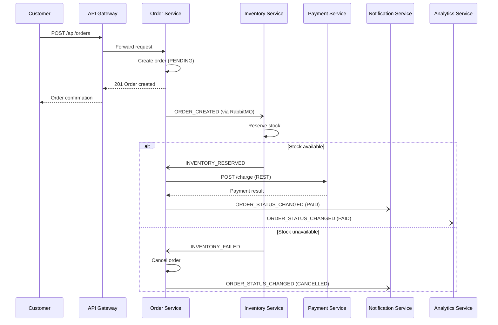

# Architecture — CommerceSphere

> Living document. Updated as services are built. Source of truth for the
> high-level service map and communication patterns.

## Service Breakdown

| Service | Responsibility | Primary DB | Phase |
|---|---|---|---|
| **API Gateway** | Request routing, auth middleware, rate limiting, CORS | — | 0 |
| **Auth Service** | Signup, login, JWT issue/refresh, RBAC | PostgreSQL | 1 |
| **User Service** | Profiles, addresses, preferences | PostgreSQL | 1 |
| **Catalog Service** | Products, categories, search | MongoDB | 2 |
| **Cart Service** | Cart CRUD, guest→user merge | Redis | 3 |
| **Order Service** | Order creation, lifecycle management | PostgreSQL | 4 |
| **Payment Service** | Payment gateway integration, webhook verification | PostgreSQL | 5 |
| **Inventory Service** | Stock management, reservation | PostgreSQL | 4 |
| **Notification Service** | Email/SMS on order-state changes (simulated) | — (consumer) | 6 |
| **Analytics Service** | Sales metrics, dashboards | PostgreSQL | 6 |

### Database-per-Service Pattern

Every service owns its own database. No service ever queries another service's
tables directly. When Service A needs data from Service B, it either:
- Makes a **synchronous REST call** (if the user is waiting), or
- Consumes an **asynchronous event** from RabbitMQ (if it can happen in the background).

This guarantees **fault isolation** (one DB going down doesn't cascade) and
allows each service to choose the storage engine that fits its data model
(e.g. MongoDB for the flexible product catalog, Redis for ephemeral cart state).

---

## Communication Patterns

### Synchronous — REST (HTTP)

Used when the **caller needs an immediate response** — the user is staring at a
spinner.

| Example | From → To |
|---|---|
| Load product page | Frontend → Gateway → Catalog Service |
| Validate SKU exists | Cart Service → Catalog Service |
| Create charge | Order Service → Payment Service |
| Check auth token | Gateway → Auth Service |

### Asynchronous — RabbitMQ (AMQP)

Used when the result can be **eventually consistent** — the action can happen in
the background without the user waiting.

| Event | Publisher | Consumer(s) |
|---|---|---|
| `ORDER_CREATED` | Order Service | Inventory Service |
| `INVENTORY_RESERVED` | Inventory Service | Payment Service / Order Service |
| `INVENTORY_FAILED` | Inventory Service | Order Service |
| `PAYMENT_COMPLETED` | Payment Service | Order Service, Notification Service |
| `ORDER_STATUS_CHANGED` | Order Service | Notification Service, Analytics Service |

**Decision rule**: *If the user is staring at a spinner waiting for this, use
REST. If it can happen in the background, use an event.*

---

## Core Event Flow — Order Placement



### Order Status Lifecycle

```
PENDING → PAID → SHIPPED → DELIVERED
   ↓                          
CANCELLED                     
```

---

## Infrastructure

| Component | Image | Purpose | Port |
|---|---|---|---|
| PostgreSQL | `postgres:16-alpine` | Relational data (auth, users, orders, payments, inventory, analytics) | 5432 |
| MongoDB | `mongo:7` | Document store (product catalog) | 27017 |
| Redis | `redis:7-alpine` | Cache (catalog), sessions, cart storage | 6379 |
| RabbitMQ | `rabbitmq:3-management-alpine` | Event bus for async service communication | 5672 / 15672 |

All infrastructure runs in Docker containers orchestrated by the root
`docker-compose.yml`. Named volumes persist data across restarts.

---

## Caching Strategy (Redis, Cache-Aside)

| Data | TTL | Invalidation |
|---|---|---|
| Product list | 5–10 min | On product create/update/delete |
| Product details | 30 min | On product update |
| Categories | 1 hr | On category change |
| User session/profile | 15–30 min | On logout / profile update |
| Cart | 1–7 days | On cart mutation |

**Pattern**: Check Redis → miss → query DB → write to Redis → return. On writes,
invalidate the relevant cache keys immediately (don't wait for TTL expiry).

---

## Security Layers

1. **API Gateway** — Helmet headers, CORS, rate limiting, JWT verification
2. **Auth Service** — bcrypt password hashing, JWT access + refresh token rotation
3. **Per-service** — Input validation (Zod/Joi), parameterized queries only
4. **Infrastructure** — Secrets via `.env` (gitignored), non-root Docker users
